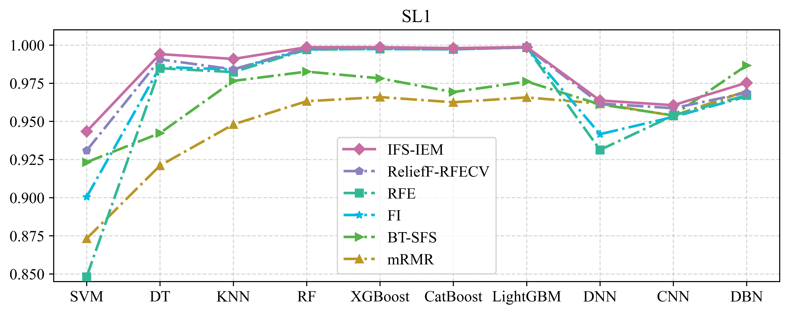

# An Interpretable Feature Selection Method Integrating Ensemble Models for Chiller Fault Diagnosis
our paper: [click](https://www.sciencedirect.com/science/article/pii/S2352710224005977)。
## Performance comparison
The following FSMs were selected for comparison with our IFS-IEM：
- Mutual Information (MI)
- Feature Importance (FI)
- Recursive Feature Elimination (RFE)
- Max-Relevance and Min-Redundancy (mRMR)
- Back-tracing sequential forward feature selection (BT-SFS)
- ReliefF-RFECV

The models include SVM, KNN, DT, DBN, DNN, CNN, RF, XGBoost, CatBoost, LightGBM were used for fault diagnosis performance testing. If you are interested in CNN/DNN design, you can refer to FD test.ipynb

## Citation
If you use this code for your research, please cite our paper:
...
Bi, J., Wang, H., Hua, M., & Yan, K. (2024). An interpretable feature selection method integrating ensemble models for chiller fault diagnosis. Journal of Building Engineering, 109029.
...
